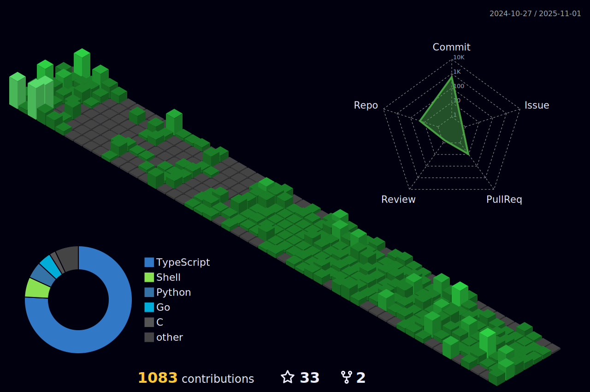

# Hello, I'm Arka! ( say Orko )

## Here are some things about me

- 🛠️ Currently building [ACEquity](https://ace.webark.in/)
- ⚙ Built [BoostStats](https://booststats.webark.in/), [DownLink](https://downlink.webark.in/) and [Osborne](https://o.webark.in/)
- 😇 Have development experience using JavaScript, Golang, and Rust
- 🐧 Been daily driving Linux for 6+ years

 
 
 

## My Tech Stack

         

    

   

  

 

 

         

   

## Contacts

You can find me on [LinkedIn](https://www.linkedin.com/in/arkorty/), [X.com](https://x.com/arkorty/), or [Mastodon](https://mastodon.social/@arkorty/). I'm open to collaborations, internships, or full-time offers. For any work-related quiries, please email me at arkorty@gmail.com.

## Buy Me a Coffee

 

## Commit Skyline

